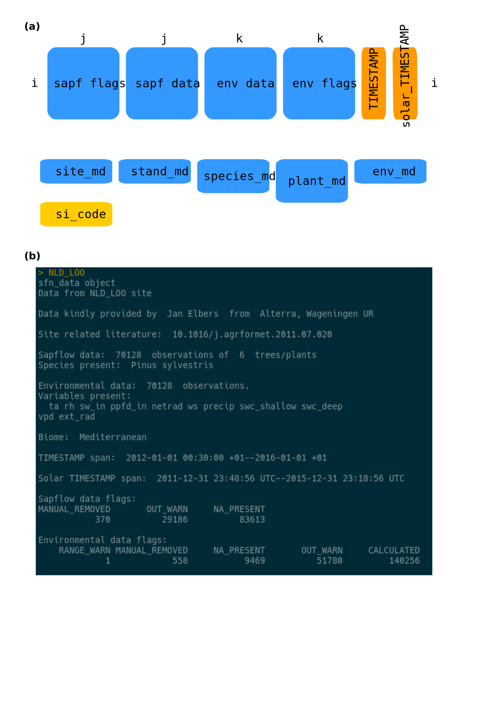

## Captions

**Figure S1.** Overview of the data QC process, showing file management,
identifying automatic and manual steps and  indicating status file updates.

**Figure S2.** Structure of sfn_data objects.

**Table S2.** Metadata variables description. 

**Figure S3.** Screenshot of the data cleaning app.

**Table S3.** Datasets in the SAPFLUXNET database identified by numeric code, 
dataset code and site name. Geographic coordinates and elevation are also shown.

**Figure S4.**Detailed geographic distribution of SAPFLUXNET datasets.

**Table S4.** Number of trees per species in the SAPFLUXNET database.

**Table S5.** Number of trees per genus in the SAPFLUXNET database.

**Table S6.** Number of species per dataset in the SAPFLUXNET database.

**Figure S5.** Treatments.


```{r setup, include=FALSE}
knitr::opts_chunk$set(echo = TRUE)
library(raster)
library(flextable)
library(pander)
library(magrittr)
library(readxl)
library(tidyverse)
library(ggrepel)
library(cowplot)
library(ggspatial)

source('metadata_wrangling.R')
load('maps_base.RData')
```


\pagebreak

```{r fig_QC, echo=FALSE,  out.height="800px",fig.align='center', fig.cap='Figure S1. Overview of the data QC process'}


```
**Figure S1.**


\pagebreak

```{r table_QC1, echo=FALSE,results='asis'}

readxl::read_xlsx('resources/table_QC1_checks.xlsx',1) %>% 
   qflextable() %>%  
  bold( i = 1,  part = "header") %>%
    fontsize(size=10,part='body') %>% 
  align(part='header',align='left') %>% 
   set_caption('Table S1. Data checks implemented in the QC1 process') %>% 
  width(width=c(1.8,5)) %>%
  height(height=c(0.4,0.6,0.2,0.7,0.4,0.4,0.2,0.4,0.4,0.4,0.2))
```
\pagebreak

```{r fig_sfn_data, echo=FALSE,  out.height="800px",fig.align='center', fig.cap='Figure S2. Structure of sfn_data objects'}


```
**Figure S2.**

\pagebreak


```{r tab_metadatavars, echo=FALSE, results='asis'}
                              
site_md_table <- sapfluxnetr:::.metadata_architecture() %>%
  magrittr::extract2(., 'site_md') %>%
  purrr::map_dfr(magrittr::extract, c('description', 'type', 'units')) %>%
  dplyr::mutate(
    variable = sapfluxnetr:::.metadata_architecture() %>%
      magrittr::extract2(., 'site_md') %>%
      names()
  ) %>%
  select(variable, everything())
stand_md_table <- sapfluxnetr:::.metadata_architecture() %>%
  magrittr::extract2(., 'stand_md') %>%
  purrr::map_dfr(magrittr::extract, c('description', 'type', 'units')) %>%
  dplyr::mutate(
    variable = sapfluxnetr:::.metadata_architecture() %>%
      magrittr::extract2(., 'stand_md') %>%
      names()
  ) %>%
  select(variable, everything())
species_md_table <- sapfluxnetr:::.metadata_architecture() %>%
  magrittr::extract2(., 'species_md') %>%
  purrr::map_dfr(magrittr::extract, c('description', 'type', 'units')) %>%
  dplyr::mutate(
    variable = sapfluxnetr:::.metadata_architecture() %>%
      magrittr::extract2(., 'species_md') %>%
      names()
  ) %>%
  select(variable, everything())
plant_md_table <- sapfluxnetr:::.metadata_architecture() %>%
  magrittr::extract2(., 'plant_md') %>%
  purrr::map_dfr(magrittr::extract, c('description', 'type', 'units')) %>%
  dplyr::mutate(
    variable = sapfluxnetr:::.metadata_architecture() %>%
      magrittr::extract2(., 'plant_md') %>%
      names()
  ) %>%
  select(variable, everything())
env_md_table <- sapfluxnetr:::.metadata_architecture() %>%
  magrittr::extract2(., 'env_md') %>%
  purrr::map_dfr(magrittr::extract, c('description', 'type', 'units')) %>%
  dplyr::mutate(
    variable = sapfluxnetr:::.metadata_architecture() %>%
      magrittr::extract2(., 'env_md') %>%
      names()
  ) %>%
  select(variable, everything())
bind_rows(
  site_md_table, stand_md_table, species_md_table, plant_md_table, env_md_table
) %>% 
  qflextable() %>%
   bold( i = 1,  part = "header") %>%
    fontsize(size=10,part='body') %>% 
  set_header_labels(
    variable = 'Variable',
    description= 'Description',
    type= 'Type',
    units= 'Units') %>% 
   set_caption('Table S2. Metadata variables description') %>% 
  width(width=c(1.8,2.25,1.2,1.2)) %>%
  height(height=c(0.4,rep(0.2,5),0.4,0.4,0.2,0.2,0.6,0.6,0.2,0.6,0.7,0.4,0.6,0.6,0.6, # 19
                  0.6,0.6,0.4,0.6,0.4,0.6,0.4,0.6,0.4,0.6,0.2,0.2,0.2,0.4,0.4,0.2,0.2,# 36
                  0.4,0.2,0.2,0.2,0.9,0.4,0.6,0.4,0.4,0.6,0.4,0.6,0.2,0.4,0.2,0.4,0.2, #53
                  0.2,0.4,0.2,0.4,0.2,0.4,0.4,0.4,0.4,0.4,0.6,0.4,0.4,0.4,0.4,0.4,0.4, # 70
                  0.4,0.4,0.4,0.4,0.4,0.4,0.6,0.4,0.2,0.4,0.4,0.4,0.6,0.4,0.7))
```

\pagebreak

```{r fig_outliers_app, echo=FALSE,  out.height="800px", fig.cap='Figure S3. Screenshot of the data cleaning app'}

knitr::include_graphics('resources/out_app.png')
```
**Figure S3.**

\pagebreak

```{r tab_sites, echo=FALSE, message=FALSE, warning=FALSE, paged.print=FALSE, results="asis"}

sfn_sites_nspecies %>% 
  left_join(sfn_allsites %>% dplyr::select(si_code,si_name,si_elev)) %>% 
  mutate(country=sapply(strsplit(si_code,"_"),"[[",1),
         num_code = as.integer(factor(si_code)))%>% 
  mutate_at(vars(si_lat,si_long),round,2) %>% 
  dplyr::select(num_code,si_code,si_name,si_lat, si_long,si_elev) %>% 
  qflextable() %>%
   bold( i = 1,  part = "header") %>%
   fontsize(size=10,part='body') %>% 
   flextable::set_header_labels(
     num_code='#',
     si_code='Dataset code',
     si_name='Site name',
     si_lat='Lat.',
     si_long='Long.',
     si_elev='Elev.') %>% 
  width(width=c(0.4,1.7,3,0.7,0.7,0.8)) %>%
  height(height=c(rep(0.2,176),rep(0.4,3),rep(0.2,23))) %>% 
   set_caption('Table S3. Datasets in the SAPFLUXNET database identified by 
               numeric code, dataset code and site name. Geographic 
               coordinates and elevation are also shown')

```

\pagebreak

```{r regional_maps,fig.height=18, fig.width=15, cache=TRUE,echo=FALSE, message=FALSE, warning=FALSE,fig.cap='Figure S4. Detailed geographic distribution of SAPFLUXNET datasets'}

source('R/sfn_datapaper_functions.R')
# a) Site labels 

# b) Select countries to plot 

countries_sfn <- unique(sapply(strsplit(sfn_allsites$si_code,"_"),"[[",1))
countries_label <- c('ARG','BRA','COL','CRI','CHN','GUF','IDN','ISR','JPN','KOR','MDG','MEX','NZL','RUS','SEN','THA','UZB')
countries_europe <- c('AUT','CHE','CZE','DEU','ESP','FIN','FRA','GBR','HUN','ITA','NLD','PRT','SWE')
countries_america <- c('CAN','USA')
countries_austral <- c('AUS')
countries_africa <- c('MDG','ZAF')


# c) Add numeric codes 

sfn_allsites_country<- sfn_allsites %>% 
  mutate(country=sapply(strsplit(si_code,"_"),"[[",1),
         num_code = as.integer(factor(si_code)))


sfn_allsites_country %>% 
  dplyr::filter(country%in%countries_europe | si_code%in%c('RUS_FYO')) %>% 
  dplyr::filter(si_code%ni%c('ESP_LAS','FIN_PET')) -> sfn_sites_europe


sfn_allsites_country %>% 
  dplyr::filter(country%in%countries_label 
                | si_code%in%c('ESP_LAS','FIN_PET','USA_BNZ_BLA','AUS_KAR')) -> sfn_sites_world

sfn_allsites_country %>% 
  dplyr::filter(country%in%countries_america & si_code%ni%c('USA_BNZ_BLA')) -> sfn_sites_america 

# 3. Map, numeric codes, ggrepel not aligned ------------------------------------------------------

# world
sfnsites_world_dr <- globforest_rec_0_1  +
  geom_point(data=sfn_allsites,aes(x=si_long,y=si_lat),shape=21,color='black',fill='royalblue',alpha=0.5)+
  geom_text_repel(data = sfn_sites_world, 
                  aes(si_long, si_lat, label = num_code), size = 3,
                  segment.alpha=0.5,  nudge_x = -0.35,direction = "both",
                  box.padding = unit(0.1, 'lines'), force = 0.5)+geom_label_repel()+guides(fill='none')+xlab(NULL)+ylab(NULL)

# europe
sfnsites_europe_dr<- globforest_rec_0_1  +
  geom_point(data=sfn_allsites,aes(x=si_long,y=si_lat),shape=21,color='black',fill='royalblue',alpha=0.5)+
  geom_text_repel(data = sfn_sites_europe, 
                  aes(si_long, si_lat, label = num_code), size = 3,
                  segment.alpha=0.5,  nudge_y = -0.35,direction = "both",
                  box.padding = unit(0.1, 'lines'), force = 0.5)+
  coord_sf(xlim = c(-20, 40), ylim = c(32, 67), expand = FALSE)+
  geom_label_repel()+guides(fill='none')+xlab(NULL)+ylab(NULL)

# america
sfnsites_america_dr<- globforest_rec_0_1  +
  geom_point(data=sfn_allsites,aes(x=si_long,y=si_lat),shape=21,color='black',fill='royalblue',alpha=0.5)+
  geom_text_repel(data = sfn_sites_america, 
                  aes(si_long, si_lat, label = num_code), size = 3,
                  segment.alpha=0.5,  nudge_x = -0.35,direction = "both",
                  box.padding = unit(0.1, 'lines'), force = 0.5)+
  coord_sf(xlim = c(-130, -60), ylim = c(30, 55), expand = FALSE)+
  geom_label_repel()+guides(fill='none')+xlab(NULL)+ylab(NULL)

# austral
sfnsites_austral_dr<- globforest_rec_0_1  +
  geom_point(data=sfn_allsites,aes(x=si_long,y=si_lat),shape=21,color='black',fill='royalblue',alpha=0.5)+
  geom_text_repel(data = subset(sfn_allsites_country,country%in%countries_austral), 
                  aes(si_long, si_lat, label = num_code), size = 3,
                  segment.alpha=0.5,  nudge_x = -0.35,
                  box.padding = unit(0.1, 'lines'), force = 0.5)+
  coord_sf(xlim = c(110, 162), ylim = c(-10, -50), expand = FALSE)+
  geom_label_repel()+guides(fill='none')+xlab(NULL)+ylab(NULL)

# africa
sfnsites_africa_dr<- globforest_rec_0_1  +
  geom_point(data=sfn_allsites,aes(x=si_long,y=si_lat),shape=21,color='black',fill='royalblue',alpha=0.5)+
  geom_text_repel(data = subset(sfn_allsites_country,country%in%countries_africa), aes(si_long, si_lat, label = num_code), size = 3,
                  box.padding = unit(0.1, 'lines'), force = 0.5)+
  coord_sf(xlim = c(10, 50), ylim = c(-10, -40), expand = FALSE)+
  geom_label_repel()+guides(fill='none')+xlab(NULL)+ylab(NULL)


# e) Build figure 

plot_grid(
  plot_grid(sfnsites_world_dr,ncol=1,nrow=1,labels=c('a)')),
  plot_grid(sfnsites_europe_dr,sfnsites_austral_dr,ncol=2,nrow=1,rel_widths=c(1,0.7),labels=c('b)','c)')),
  plot_grid(sfnsites_america_dr,sfnsites_africa_dr,ncol=2,nrow=1,rel_widths=c(1,0.7),labels=c('d)','e)')),
  nrow=3,rel_heights=c(1,1,0.7))

```
**Figure S4.**

\pagebreak

```{r tab_ntrees_species, echo=FALSE, message=FALSE, warning=FALSE, paged.print=TRUE, results="asis"}

sfn_species_ntrees %>% 
  select(species,n_trees) -> sfn_species_ntrees_reduced

data.frame(sfn_species_ntrees_reduced[1:58,],
          sfn_species_ntrees_reduced[59:116,],
           sfn_species_ntrees_reduced[117:174,])%>% 

  flextable::qflextable() %>% 
  flextable::autofit(add_w=0,add_h=0) %>%
  flextable::set_header_labels(
    species='Species',
    n_trees= 'N trees',
    species.1='Species',
    n_trees.1= 'N trees',
    species.2='Species',
    n_trees.2= 'N trees') %>% 
  flextable::bold( i = 1,  part = "header") %>% 
  fontsize(size=10,part='body') %>% 
  italic(j=c(1,3,5)) %>% 
  height(height=c(rep(.2,7),0.4,rep(.2,6),0.4,rep(.2,26),0.4,rep(.2,16))) %>% 
  width(width=c(2,0.5,2,0.3,2,0.3)) %>% 
  flextable::set_caption('Table S4. Number of trees per species in the SAPFLUXNET database')

```


\pagebreak
```{r tab_ntrees_genus, echo=FALSE, message=FALSE, warning=FALSE, paged.print=TRUE, results="asis"}

data.frame(sfn_genus_ntrees[1:32,],
          sfn_genus_ntrees[33:64,],
         add_row(sfn_genus_ntrees[65:95,],genus_f=NA,n_trees=''))%>% 
  qflextable() %>% 
  autofit(add_w=0,add_h=0) %>%
  set_header_labels(
    genus_f= 'Genus',
    n_trees = 'N trees',
    genus_f.1= 'Genus',
    n_trees.1 = 'N trees',
    genus_f.2= 'Genus',
    n_trees.2 = 'N trees') %>% 
   bold( i = 1,  part = "header") %>% 
  fontsize(size=10,part='body') %>% 
  italic(j=c(1,3,5)) %>% 
  height(height=.2) %>% 
 flextable::set_caption('Table S5. Number of trees per genus in the SAPFLUXNET database')

```
\pagebreak

```{r tab_nspecies_dataset, echo=FALSE, message=FALSE, warning=FALSE, paged.print=TRUE, results="asis"}
data.frame(sfn_nspecies_dataset[1:58,],
           sfn_nspecies_dataset[59:116,],
           sfn_nspecies_dataset[117:174,])%>% 
  flextable::qflextable() %>% 
  flextable::autofit(add_w=0,add_h=0) %>%
  flextable::set_header_labels(
    sp_name='Species',
    n_sites= 'N datasets',
    sp_name.1='Species',
    n_sites.1= 'N datasets',
    sp_name.2='Species',
    n_sites.2= 'N datasets') %>% 
  flextable::bold( i = 1,  part = "header") %>% 
  fontsize(size=10,part='body') %>% 
  italic(j=c(1,3,5)) %>% 
    width(width=c(2,0.5,2,0.3,2,0.3)) %>% 
  height(height=c(rep(.2,5),0.4,rep(.2,12),0.4,rep(.2,33),0.4,rep(.2,5))) %>% 
    add_header_lines() %>% 
flextable::set_caption('Table S6. Number of species per dataset in the SAPFLUXNET database')

```
\pagebreak


```{r wordclouds_treatments, echo = FALSE, fig.height=7, fig.width=7, message=FALSE, warning=FALSE}
library(wordcloud)
library(wordcloud2)
library(tm)
library(gridGraphics)

set.seed(63025)

# plant wordcloud
corpus_processed <- 
  sfn_allplants_tax %>%
  pull(pl_treatment) %>%
  VectorSource() %>%
  Corpus() %>%
  tm_map(removeNumbers) %>%
  tm_map(removePunctuation) %>%
  tm_map(stripWhitespace) %>%
  tm_map(content_transformer(tolower)) %>%
  tm_map(removeWords, stopwords("english")) %>%
  TermDocumentMatrix() %>%
  as.matrix() %>%
  rowSums() %>%
  sort(decreasing = TRUE)

wordcloud_data <- tibble(
  word = names(corpus_processed),
  freq = corpus_processed
)

wordcloud_plant <- function() {
  wordcloud(
    wordcloud_data[['word']], wordcloud_data[['freq']],
    min.freq = 1,
    max.words = 100,
    random.order = TRUE, rot.per = 0,
    scale = c(2.5, 0.5)
  )
}

# stand wordcloud
corpus_processed_stand <- 
  sfn_allstands %>%
  pull(st_treatment) %>%
  VectorSource() %>%
  Corpus() %>%
  tm_map(removeNumbers) %>%
  tm_map(removePunctuation) %>%
  tm_map(stripWhitespace) %>%
  tm_map(content_transformer(tolower)) %>%
  tm_map(removeWords, stopwords("english")) %>%
  TermDocumentMatrix() %>%
  as.matrix() %>%
  rowSums() %>%
  sort(decreasing = TRUE)

wordcloud_data_stand <- tibble(
  word = names(corpus_processed_stand),
  freq = corpus_processed_stand
)


wordcloud_stand <- function() {
  wordcloud(
    wordcloud_data_stand[['word']], wordcloud_data_stand[['freq']],
    min.freq = 1,
    max.words = 100,
    random.order = TRUE, rot.per = 0.15,
    scale = c(2.5, 0.25)
  )  
}

cowplot::plot_grid(
  wordcloud_plant, wordcloud_stand,
  nrow = 2, labels = c('Plant treatments', 'Stand treatments'),
  scale = c(1.2, 1.2)
)
```
**Figure S5.**